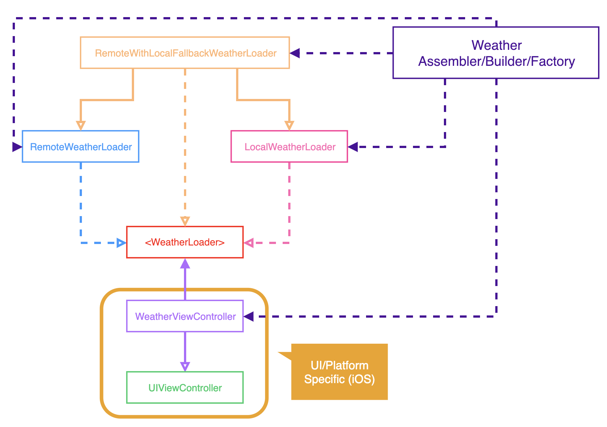

# American Dream - Weather Feature
## BDD Specs

### Story: Customer requests to see their weather feed

### Narrative #1
> As an online customer
I want the app to automatically load my latest weather feed
So I can always get the weather of my friends city

#### Scenarios (Acceptance criteria)
```
Given the customer has connectivity
When the customer requests to see their feed
Then the app should display the latest feed from remote
And replace the cache with the new feed
```
### Narrative #2
> As an offline customer
I want the app to show the latest saved version of my weather feed (name city)
So I can always track the name of the city name's of my friends

#### Scenarios (Acceptance criteria)
```
Given the customer doesn't have connectivity
When the customer requests to see the feed
Then the app should display the latest names weather city saved (with an error message)

Given the customer doesn't have connectivity
And the cash is empty
When the customer requests to see the feed
Then the app should display an error message
```

## Use Cases

### Load Feed Use Case

#### Data:
- URL

#### Primary course (happy path):
1. Execute "Load Weather Items" command with above data.
2. System downloads data from the URL.
3. System validates downloaded data.
4. System creates weather items from valid data.
5. System delivers feed items.

#### Invalid data - error course (sad path):
1. System delivers error.

#### No connectivity - error course (sad path):
1. System delivers error.

### Load Weather Fallback (Cache) Use Case

#### Data:
- Last saved

#### Primary course:
1. Execute "Retrieve Weather Items" command with above data.
2. System fetches weather data from cache.
3. System validates last saved data.
4. System creates weather items from cached data.
5. System delivers feed items.
6. System refresh weather data with saved with new request URL

#### Expired cache course (sad path):
1. System delivers no weather items.

#### Empty cache course (sad path):
1. System delivers no weather items.

#### System can't refresh weather data (sad path):
1. System delivers name city.
2. System delivers error.

### Save Weathehr Items Use Case

#### Data:
- Feed items

#### Primary course (happy path):
1. Execute "Save Weather Items" command with above data.
2. System encodes feed items.
3. System timestamps the new cache.
4. System replaces the cache with new data.
5. System delivers success message.

## Flowchart


## Architecture


## Model Specs

### Feed Item

| Property		| Type 		|
|---------------	|------------	|
| `name`		| `String`	|
| `dt`	| `Int`	|
| `wind`			| `Double`	|
| `temperature`    | `Double`    |
| `weather`        | `String`    |
| `description`        | `String`    |

### Payload contract

```
GET *url*

200 RESPONSE

{
"name": "Paris",
"dt": 132123123,
"main": {
"temp": 1.0
},
"weather": [{
"main": "Clear",
"description": "clear sky"
}],
"wind": {
"speed": 2.0
}
}
